# Documento de Diseño - Mapa Interactivo de Propiedades

## Resumen
Este documento define el diseño técnico para implementar un mapa interactivo de propiedades en la página principal de Marconi Inmobiliaria. El mapa mostrará todas las propiedades disponibles mediante marcadores geográficos, se sincronizará automáticamente con el estado de las propiedades en la base de datos, y se integrará con el sistema de análisis existente.

**Tecnología seleccionada:** React Leaflet con OpenStreetMap
**Integración:** Next.js 15 App Router, Supabase, Sistema de Analytics
**Despliegue:** Vercel

## Decisiones Técnicas Clave

### Selección de Tecnología de Mapeo

Después de evaluar las opciones mencionadas en los requisitos (uMap, Leaflet.js, Google Maps, Mapbox), se ha decidido utilizar **React Leaflet** con **OpenStreetMap** por las siguientes razones:

| Criterio | uMap | React Leaflet | Google Maps | Mapbox |
|----------|------|---------------|-------------|---------|
| **Costo** | Gratis | Gratis | Requiere API key, costos después de cuota | Freemium, limitaciones |
| **Integración React/Next.js** | Limitada (iframe) | Excelente (componentes nativos) | Buena | Excelente |
| **Personalización** | Limitada | Alta | Media | Alta |
| **Performance** | Media | Buena | Excelente | Excelente (WebGL) |
| **Clustering nativo** | No | Sí (react-leaflet-cluster) | Sí | Sí |
| **Facilidad de uso** | Alta | Media | Alta | Media |
| **Comunidad/Soporte** | Pequeña | Grande (1.4M descargas/mes) | Grande | Grande |
| **Sin dependencias externas** | No | Sí | No (API key) | No (API key) |

**Decisión:** React Leaflet + OpenStreetMap
- No requiere API keys ni costos
- Excelente integración con React y Next.js 15
- Alta personalización y control programático
- Librerías de clustering maduras disponibles
- Compatible con el stack tecnológico existente
- Amplia documentación y comunidad activa

### Fuentes de Investigación

- [Embed OpenStreetMap in a Next.js Project](https://cloudinary.com/blog/guest_post/embed-openstreetmap-in-a-next-js-project)
- [React Leaflet on Next.js 15 App Router](https://xxlsteve.net/blog/react-leaflet-on-next-15/)
- [Optimizing Leaflet Performance with Large Number of Markers](https://medium.com/@silvajohnny777/optimizing-leaflet-performance-with-a-large-number-of-markers-0dea18c2ec99)
- npm: react-leaflet, react-leaflet-cluster, leaflet

## Arquitectura del Sistema

### Diagrama de Arquitectura General


### Diagrama de Flujo de Datos

```mermaid
graph LR
    A[Usuario carga página principal] --> B[InteractivePropertyMap se monta]
    B --> C[usePropertyMap hook]
    C --> D[Fetch /api/properties/map-locations]
    D --> E[MapService.getMapProperties]
    E --> F[Supabase Query con filtros]
    F --> G{¿Propiedades encontradas?}
    G -->|Sí| H[Renderizar Mapa con Markers]
    G -->|No| I[Mostrar mensaje: Sin propiedades]
    H --> J[Usuario hace clic en pin]
    J --> K[Mostrar PropertyMapPopup]
    K --> L[trackInteraction: pin_click]
    L --> M[Analytics API]
    J --> N[Usuario hace clic en Ver Detalles]
    N --> O[trackInteraction: view_details_from_map]
    O --> M
    N --> P[Navegar a /propiedades/[id]]
```

## Diseño de Componentes

### Estructura de Archivos

```
app/
  page.tsx                              # Página principal (incluirá el mapa)
  api/
    properties/
      map-locations/
        route.ts                         # Nuevo endpoint para datos del mapa

components/
  InteractivePropertyMap.tsx             # Componente principal del mapa
  map/
    PropertyMapMarker.tsx                # Marcador individual de propiedad
    PropertyMapPopup.tsx                 # Popup con información de propiedad
    MapLoadingState.tsx                  # Estado de carga
    MapErrorState.tsx                    # Estado de error
    MapEmptyState.tsx                    # Estado sin propiedades

hooks/
  usePropertyMap.ts                      # Hook personalizado para lógica del mapa

services/
  map.ts                                 # Servicio de negocio del mapa

types/
  map.ts                                 # Tipos TypeScript para el mapa

lib/
  map-config.ts                          # Configuración del mapa (coordenadas, zoom, etc.)
```

### Componente 1: InteractivePropertyMap

**Responsabilidades:**
- Renderizar el mapa de Leaflet
- Gestionar el estado de carga, error y vacío
- Orquestar los marcadores y popups
- Integrar con el sistema de analytics
- Manejar interacciones del usuario (zoom, pan, click)

**Interfaz:**

```typescript
interface InteractivePropertyMapProps {
  /** Altura del mapa en píxeles o porcentaje */
  height?: string | number
  /** Zoom inicial del mapa */
  initialZoom?: number
  /** Centro inicial del mapa */
  initialCenter?: [number, number]
  /** Si debe mostrar clustering de marcadores */
  enableClustering?: boolean
  /** Número máximo de propiedades a mostrar */
  maxProperties?: number
  /** Clase CSS adicional */
  className?: string
  /** Callback cuando se hace clic en una propiedad */
  onPropertyClick?: (propertyId: number) => void
}
```

**Dependencias:**
- `react-leaflet`: MapContainer, TileLayer, useMap
- `react-leaflet-cluster`: MarkerClusterGroup
- `leaflet`: Tipos y utilidades
- `usePropertyMap`: Hook personalizado para datos
- `useAnalytics`: Hook de analytics
- Componentes: PropertyMapMarker, PropertyMapPopup, MapLoadingState, MapErrorState, MapEmptyState

**Implementación Clave:**

Dado que Leaflet requiere renderizado del lado del cliente (usa el objeto `window`), el componente debe cargarse dinámicamente:

```typescript
// En app/page.tsx o donde se use
import dynamic from 'next/dynamic'

const InteractivePropertyMap = dynamic(
  () => import('@/components/InteractivePropertyMap'),
  {
    ssr: false,
    loading: () => <MapLoadingState />
  }
)
```

### Componente 2: PropertyMapMarker

**Responsabilidades:**
- Renderizar un marcador individual de propiedad
- Gestionar el estado de hover/click
- Mostrar el popup asociado
- Registrar eventos de analytics

**Interfaz:**

```typescript
interface PropertyMapMarkerProps {
  property: MapPropertyData
  isSelected?: boolean
  onMarkerClick?: (propertyId: number) => void
}

interface MapPropertyData {
  id: number
  title: string
  price: number
  currency: string
  latitude: number
  longitude: number
  property_type: string
  operation_type: string
  images: string[]
}
```

**Dependencias:**
- `react-leaflet`: Marker, Popup
- `leaflet`: Icon, LatLngExpression
- PropertyMapPopup
- useAnalytics

### Componente 3: PropertyMapPopup

**Responsabilidades:**
- Mostrar información resumida de la propiedad
- Proporcionar enlace a la página de detalles
- Disparar eventos de analytics

**Interfaz:**

```typescript
interface PropertyMapPopupProps {
  property: MapPropertyData
  onViewDetails?: (propertyId: number) => void
}
```

**Dependencias:**
- Next.js Link
- Utilidades de formato (precio, tipo de propiedad)
- useAnalytics

### Componente 4: MapLoadingState

**Responsabilidades:**
- Mostrar skeleton loader mientras se carga el mapa

**Interfaz:**

```typescript
interface MapLoadingStateProps {
  height?: string | number
}
```

### Componente 5: MapErrorState

**Responsabilidades:**
- Mostrar mensaje de error cuando falla la carga
- Proporcionar botón de reintento

**Interfaz:**

```typescript
interface MapErrorStateProps {
  error: Error
  onRetry?: () => void
  height?: string | number
}
```

### Componente 6: MapEmptyState

**Responsabilidades:**
- Mostrar mensaje cuando no hay propiedades disponibles

**Interfaz:**

```typescript
interface MapEmptyStateProps {
  message?: string
  height?: string | number
}
```

## Modelo de Datos

### Tipo: MapPropertyData

Estructura optimizada que contiene solo los campos necesarios para el mapa:

```typescript
export interface MapPropertyData {
  id: number
  title: string
  price: number
  currency: string
  latitude: number
  longitude: number
  property_type: string
  operation_type: string
  images: string[]  // Solo para mostrar primera imagen en popup
  status: string    // Siempre será "available" por filtrado
}
```

### Tipo: MapConfig

Configuración del mapa:

```typescript
export interface MapConfig {
  /** Centro inicial del mapa (Reconquista, Santa Fe) */
  defaultCenter: [number, number]
  /** Zoom por defecto */
  defaultZoom: number
  /** Zoom mínimo permitido */
  minZoom: number
  /** Zoom máximo permitido */
  maxZoom: number
  /** Límites geográficos de Argentina */
  bounds: {
    north: number
    south: number
    east: number
    west: number
  }
  /** URL del tile provider (OpenStreetMap) */
  tileLayerUrl: string
  /** Atribución requerida por OpenStreetMap */
  attribution: string
  /** Threshold para activar clustering */
  clusterThreshold: number
}
```

### Tipo: MapInteractionEvent

Evento de analytics para interacciones del mapa:

```typescript
export interface MapInteractionEvent {
  event_type: 'map_pin_click' | 'map_view_details' | 'map_zoom' | 'map_pan'
  property_id?: number
  zoom_level?: number
  center?: [number, number]
  timestamp: string
}
```

## Servicios y Lógica de Negocio

### MapService

**Ubicación:** `services/map.ts`

**Responsabilidades:**
- Obtener propiedades optimizadas para el mapa desde Supabase
- Aplicar filtros de coordenadas válidas y status
- Validar límites geográficos
- Transformar datos de BD a formato del mapa

**Métodos principales:**

```typescript
export class MapService {
  /**
   * Obtiene propiedades con coordenadas válidas para mostrar en el mapa
   * Solo retorna propiedades con status = "available" y coordenadas definidas
   */
  static async getMapProperties(): Promise<MapPropertyData[]>

  /**
   * Valida que las coordenadas estén dentro de Argentina
   * @returns true si las coordenadas son válidas
   */
  static validateCoordinates(latitude: number, longitude: number): boolean

  /**
   * Calcula los límites geográficos para ajustar el viewport del mapa
   * @param properties Array de propiedades
   * @returns Bounds para fitBounds de Leaflet
   */
  static calculateBounds(properties: MapPropertyData[]): [[number, number], [number, number]] | null

  /**
   * Transforma propiedad de BD a formato optimizado para mapa
   */
  static transformPropertyForMap(property: Property): MapPropertyData
}
```

**Consulta Supabase optimizada:**

```typescript
static async getMapProperties(): Promise<MapPropertyData[]> {
  const { data, error } = await supabase
    .from('properties')
    .select('id, title, price, currency, latitude, longitude, property_type, operation_type, images')
    .eq('status', 'available')
    .not('latitude', 'is', null)
    .not('longitude', 'is', null)
    .order('created_at', { ascending: false })

  if (error) {
    throw new Error(`Error fetching map properties: ${error.message}`)
  }

  // Filtrar coordenadas válidas dentro de Argentina
  const validProperties = (data || []).filter(property =>
    this.validateCoordinates(property.latitude!, property.longitude!)
  )

  return validProperties.map(this.transformPropertyForMap)
}
```

### Hook: usePropertyMap

**Ubicación:** `hooks/usePropertyMap.ts`

**Responsabilidades:**
- Gestionar el estado de las propiedades del mapa
- Manejar carga, error y estados vacíos
- Proporcionar funciones de reintento
- Cachear datos del mapa en el cliente

**Interfaz:**

```typescript
export interface UsePropertyMapOptions {
  /** Si debe cargar automáticamente */
  autoLoad?: boolean
  /** Intervalo de refresco en ms (0 = no refrescar) */
  refreshInterval?: number
  /** Callback cuando se cargan las propiedades */
  onPropertiesLoaded?: (properties: MapPropertyData[]) => void
  /** Callback cuando ocurre un error */
  onError?: (error: Error) => void
}

export interface UsePropertyMapResult {
  /** Propiedades cargadas para el mapa */
  properties: MapPropertyData[]
  /** Estado de carga */
  loading: boolean
  /** Error si ocurrió */
  error: Error | null
  /** Función para recargar propiedades */
  refresh: () => Promise<void>
  /** Límites calculados para el mapa */
  bounds: [[number, number], [number, number]] | null
  /** Si no hay propiedades disponibles */
  isEmpty: boolean
}
```

**Implementación:**

```typescript
export function usePropertyMap(options: UsePropertyMapOptions = {}): UsePropertyMapResult {
  const {
    autoLoad = true,
    refreshInterval = 0,
    onPropertiesLoaded,
    onError
  } = options

  const [properties, setProperties] = useState<MapPropertyData[]>([])
  const [loading, setLoading] = useState(false)
  const [error, setError] = useState<Error | null>(null)
  const [bounds, setBounds] = useState<[[number, number], [number, number]] | null>(null)

  const loadProperties = useCallback(async () => {
    try {
      setLoading(true)
      setError(null)

      const response = await fetch('/api/properties/map-locations')
      if (!response.ok) {
        throw new Error(`HTTP error! status: ${response.status}`)
      }

      const data = await response.json()
      setProperties(data.properties || [])

      // Calcular bounds
      if (data.properties && data.properties.length > 0) {
        const calculatedBounds = calculateMapBounds(data.properties)
        setBounds(calculatedBounds)
      }

      onPropertiesLoaded?.(data.properties || [])
    } catch (err) {
      const error = err instanceof Error ? err : new Error('Error desconocido')
      setError(error)
      onError?.(error)
    } finally {
      setLoading(false)
    }
  }, [onPropertiesLoaded, onError])

  // Auto-load al montar
  useEffect(() => {
    if (autoLoad) {
      loadProperties()
    }
  }, [autoLoad, loadProperties])

  // Refresh interval
  useEffect(() => {
    if (refreshInterval > 0) {
      const interval = setInterval(loadProperties, refreshInterval)
      return () => clearInterval(interval)
    }
  }, [refreshInterval, loadProperties])

  return {
    properties,
    loading,
    error,
    refresh: loadProperties,
    bounds,
    isEmpty: !loading && !error && properties.length === 0
  }
}
```

## API Endpoints

### GET /api/properties/map-locations

**Ubicación:** `app/api/properties/map-locations/route.ts`

**Descripción:** Endpoint optimizado para obtener propiedades con coordenadas válidas para el mapa

**Query Parameters:** Ninguno (siempre retorna propiedades available con coordenadas)

**Response:**

```typescript
{
  success: true,
  properties: MapPropertyData[],
  count: number,
  timestamp: string
}
```

**Códigos de Estado:**
- 200: Éxito
- 500: Error del servidor

**Implementación:**

```typescript
import { NextResponse } from 'next/server'
import { MapService } from '@/services/map'

export async function GET() {
  try {
    const properties = await MapService.getMapProperties()

    return NextResponse.json({
      success: true,
      properties,
      count: properties.length,
      timestamp: new Date().toISOString()
    })
  } catch (error) {
    console.error('Map locations API error:', error)
    return NextResponse.json(
      {
        success: false,
        error: 'Error al cargar propiedades del mapa'
      },
      { status: 500 }
    )
  }
}
```

## Procesos de Negocio

### Proceso 1: Carga y Renderizado Inicial del Mapa


### Proceso 2: Interacción del Usuario con Marcador


### Proceso 3: Sincronización Automática con Estado de Propiedades

```mermaid
flowchart TD
    A[Admin modifica propiedad en panel] --> B[PropertyService.updateProperty]
    B --> C[Supabase UPDATE properties]
    C --> D{¿Cambió status?}
    D -->|No| E[Fin]
    D -->|Sí| F{¿Nuevo status = available?}
    F -->|Sí| G[Propiedad aparece en mapa en próxima carga]
    F -->|No| H[Propiedad desaparece del mapa en próxima carga]
    G --> I[Usuario recarga página principal]
    H --> I
    I --> J[usePropertyMap.loadProperties]
    J --> K[MapService.getMapProperties]
    K --> L[Filtro: status = 'available']
    L --> M[Retorna solo propiedades disponibles]
    M --> N[Mapa actualizado con estado correcto]
```



Nota: La sincronización es automática pero requiere que el usuario recargue la página. No se implementa actualización en tiempo real para mantener la simplicidad según las directrices de CLAUDE.md.

### Proceso 4: Clustering Automático de Marcadores

```mermaid
flowchart TD
    A[Mapa renderiza propiedades] --> B{¿Cantidad > 50?}
    B -->|No| C[Renderizar markers sin clustering]
    B -->|Sí| D[Activar MarkerClusterGroup]
    D --> E[Agrupar markers cercanos]
    E --> F{¿Usuario hace zoom in?}
    F -->|Sí| G[Clusters se expanden mostrando más markers]
    G --> H{¿Zoom suficiente?}
    H -->|Sí| I[Mostrar markers individuales]
    H -->|No| F
    F -->|No| J{¿Usuario hace zoom out?}
    J -->|Sí| K[Markers se agrupan en clusters]
    K --> E
    J -->|No| L[Mantener vista actual]
```



## Integración con Sistemas Existentes

### Integración con Analytics

El mapa se integra con el sistema de analytics existente (`services/analytics.ts` y `hooks/useAnalytics.ts`) para rastrear:

1. **Eventos de Interacción del Mapa:**
   - `map_loaded`: Cuando el mapa se carga exitosamente
   - `map_pin_click`: Cuando el usuario hace clic en un pin
   - `map_view_details`: Cuando el usuario hace clic en "Ver Detalles" desde el popup
   - `map_error`: Cuando ocurre un error al cargar el mapa

2. **Implementación:**

```typescript
// En InteractivePropertyMap.tsx
const { trackInteraction } = useAnalytics()

useEffect(() => {
  if (properties.length > 0) {
    trackInteraction('map_loaded', undefined, undefined, {
      properties_count: properties.length,
      clustering_enabled: enableClustering
    })
  }
}, [properties, trackInteraction])

// En PropertyMapMarker.tsx
const handleMarkerClick = () => {
  trackInteraction('map_pin_click', `property-${property.id}`, property.id, {
    property_type: property.property_type,
    operation_type: property.operation_type,
    price: property.price
  })
  onMarkerClick?.(property.id)
}

// En PropertyMapPopup.tsx
const handleViewDetails = () => {
  trackInteraction('map_view_details', `property-${property.id}`, property.id, {
    source: 'interactive_map'
  })
  router.push(`/propiedades/${property.id}`)
}
```

### Integración con Supabase

El mapa utiliza la conexión Supabase existente (`lib/supabase.ts`) y sigue los mismos patrones del proyecto:

- Uso de `supabase` client (no `supabaseAdmin`) para operaciones públicas
- Tipado estricto con tipos de `Database`
- Manejo de errores consistente con el resto del proyecto
- Uso de servicios dedicados (`MapService`) en lugar de llamadas directas

### Integración con Next.js 15

**Dynamic Import para SSR:**

```typescript
// En app/page.tsx
const InteractivePropertyMap = dynamic(
  () => import('@/components/InteractivePropertyMap'),
  {
    ssr: false,  // Leaflet requiere window object
    loading: () => <MapLoadingState />
  }
)
```

**Client Component:**

```typescript
// En components/InteractivePropertyMap.tsx
'use client'

import { MapContainer, TileLayer } from 'react-leaflet'
// ... resto del componente
```

## Gestión de Estado

El mapa utiliza un enfoque de estado local con hooks personalizados, consistente con el patrón del proyecto:

1. **Estado del Componente (useState):**
   - Estado de marcadores seleccionados
   - Estado del popup abierto
   - Configuración del mapa (zoom, centro)

2. **Estado del Hook usePropertyMap:**
   - Propiedades cargadas
   - Estado de carga/error
   - Bounds calculados

3. **Estado del Hook useAnalytics:**
   - Session ID
   - Estado de opt-out
   - Métricas de interacción

**No se utiliza:**
- Redux/Zustand (no hay estado global en el proyecto)
- Context API (innecesario para este feature)
- Server State Management (SWR/React Query) para mantener simplicidad

## Manejo de Errores

### Estrategia de Manejo de Errores

```typescript
export enum MapErrorType {
  NETWORK_ERROR = 'network_error',
  API_ERROR = 'api_error',
  INVALID_COORDINATES = 'invalid_coordinates',
  LEAFLET_ERROR = 'leaflet_error',
  NO_PROPERTIES = 'no_properties'
}

export class MapError extends Error {
  constructor(
    public type: MapErrorType,
    message: string,
    public recoverable: boolean = true
  ) {
    super(message)
    this.name = 'MapError'
  }
}
```

### Manejo por Tipo de Error

1. **Error de Red (Network Error):**
   - **Mostrar:** MapErrorState con botón "Reintentar"
   - **Log:** `console.error('Map network error:', error)`
   - **Recuperable:** Sí

2. **Error de API:**
   - **Mostrar:** MapErrorState con mensaje específico
   - **Log:** Error registrado en consola y analytics
   - **Recuperable:** Sí

3. **Error de Coordenadas Inválidas:**
   - **Mostrar:** Warning en consola, omitir propiedad
   - **Log:** `console.warn('Invalid coordinates for property:', propertyId)`
   - **Recuperable:** Sí (se omite la propiedad, el resto funciona)

4. **Error de Leaflet:**
   - **Mostrar:** MapErrorState genérico
   - **Log:** Error completo en consola
   - **Recuperable:** Depende del error

5. **Sin Propiedades Disponibles:**
   - **Mostrar:** MapEmptyState con mensaje informativo
   - **Log:** Info log
   - **Recuperable:** No aplicable

### Ejemplo de Implementación

```typescript
// En usePropertyMap.ts
const loadProperties = async () => {
  try {
    setLoading(true)
    setError(null)

    const response = await fetch('/api/properties/map-locations')

    if (!response.ok) {
      throw new MapError(
        MapErrorType.API_ERROR,
        `Error HTTP: ${response.status}`,
        true
      )
    }

    const data = await response.json()

    if (!data.properties) {
      throw new MapError(
        MapErrorType.API_ERROR,
        'Respuesta de API inválida',
        true
      )
    }

    setProperties(data.properties)
  } catch (err) {
    if (err instanceof MapError) {
      setError(err)
    } else if (err instanceof TypeError) {
      setError(new MapError(
        MapErrorType.NETWORK_ERROR,
        'Error de conexión. Verifica tu internet.',
        true
      ))
    } else {
      setError(new MapError(
        MapErrorType.API_ERROR,
        'Error desconocido al cargar propiedades',
        true
      ))
    }
    console.error('Map loading error:', err)
  } finally {
    setLoading(false)
  }
}
```

## Estrategias de Optimización de Rendimiento

### 1. Clustering de Marcadores

**Implementación:** react-leaflet-cluster

**Configuración:**

```typescript
<MarkerClusterGroup
  chunkedLoading
  spiderfyOnMaxZoom
  showCoverageOnHover={false}
  maxClusterRadius={50}
  iconCreateFunction={(cluster) => {
    const count = cluster.getChildCount()
    return L.divIcon({
      html: `<div class="cluster-icon">${count}</div>`,
      className: 'custom-cluster-icon',
      iconSize: L.point(40, 40)
    })
  }}
>
  {properties.map(property => (
    <PropertyMapMarker key={property.id} property={property} />
  ))}
</MarkerClusterGroup>
```

**Activación:**
- Automático cuando hay más de 50 propiedades
- Configurable mediante prop `enableClustering`

### 2. Lazy Loading de Componente

```typescript
// Dynamic import para evitar cargar Leaflet en SSR
const InteractivePropertyMap = dynamic(
  () => import('@/components/InteractivePropertyMap'),
  { ssr: false, loading: () => <MapLoadingState /> }
)
```

### 3. Optimización de Datos

**Endpoint API optimizado:**
- Solo retorna campos necesarios (no todos los campos de la tabla properties)
- Filtrado en base de datos (no en cliente)
- Sin paginación (carga todas las propiedades available de una vez)

```sql
-- Query SQL efectiva ejecutada
SELECT id, title, price, currency, latitude, longitude,
       property_type, operation_type, images
FROM properties
WHERE status = 'available'
  AND latitude IS NOT NULL
  AND longitude IS NOT NULL
ORDER BY created_at DESC
```

### 4. Memoización de Cálculos

```typescript
// Calcular bounds solo cuando cambian las propiedades
const bounds = useMemo(() => {
  if (properties.length === 0) return null
  return MapService.calculateBounds(properties)
}, [properties])

// Memoizar configuración del mapa
const mapConfig = useMemo(() => MAP_CONFIG, [])
```

### 5. Debouncing de Eventos

```typescript
// Debounce para eventos de zoom/pan (no registrar cada movimiento)
const debouncedTrackMapMove = useMemo(
  () => debounce((center: [number, number], zoom: number) => {
    trackInteraction('map_pan', undefined, undefined, { center, zoom })
  }, 1000),
  [trackInteraction]
)
```

### 6. Optimización de Imágenes

```typescript
// En PropertyMapPopup, mostrar solo thumbnail de primera imagen
<Image
  src={property.images[0]}
  alt={property.title}
  width={80}
  height={60}
  loading="lazy"
  className="rounded"
/>
```

### 7. Timeouts de Carga

```typescript
// En usePropertyMap, implementar timeout para evitar carga infinita
const LOAD_TIMEOUT = 10000 // 10 segundos

const loadProperties = async () => {
  const controller = new AbortController()
  const timeoutId = setTimeout(() => controller.abort(), LOAD_TIMEOUT)

  try {
    const response = await fetch('/api/properties/map-locations', {
      signal: controller.signal
    })
    // ... resto del código
  } catch (err) {
    if (err.name === 'AbortError') {
      throw new MapError(
        MapErrorType.NETWORK_ERROR,
        'La carga del mapa excedió el tiempo límite',
        true
      )
    }
    throw err
  } finally {
    clearTimeout(timeoutId)
  }
}
```

## Diseño Responsive

### Breakpoints

```typescript
export const MAP_RESPONSIVE_CONFIG = {
  mobile: {
    breakpoint: 768,
    height: '400px',
    defaultZoom: 12,
    clusterRadius: 60
  },
  tablet: {
    breakpoint: 1024,
    height: '500px',
    defaultZoom: 13,
    clusterRadius: 50
  },
  desktop: {
    breakpoint: Infinity,
    height: '600px',
    defaultZoom: 13,
    clusterRadius: 40
  }
}
```

### Implementación Responsive

```typescript
// Hook para detectar tamaño de pantalla
function useMapResponsive() {
  const [config, setConfig] = useState(MAP_RESPONSIVE_CONFIG.desktop)

  useEffect(() => {
    const handleResize = () => {
      const width = window.innerWidth
      if (width < MAP_RESPONSIVE_CONFIG.mobile.breakpoint) {
        setConfig(MAP_RESPONSIVE_CONFIG.mobile)
      } else if (width < MAP_RESPONSIVE_CONFIG.tablet.breakpoint) {
        setConfig(MAP_RESPONSIVE_CONFIG.tablet)
      } else {
        setConfig(MAP_RESPONSIVE_CONFIG.desktop)
      }
    }

    handleResize()
    window.addEventListener('resize', handleResize)
    return () => window.removeEventListener('resize', handleResize)
  }, [])

  return config
}

// En InteractivePropertyMap
const responsiveConfig = useMapResponsive()

<MapContainer
  style={{ height: responsiveConfig.height, width: '100%' }}
  zoom={responsiveConfig.defaultZoom}
  // ...
>
```

### CSS Responsive

```css
/* Controles del mapa */
.leaflet-control-zoom {
  /* Mobile: botones más grandes para touch */
  @media (max-width: 768px) {
    .leaflet-control-zoom-in,
    .leaflet-control-zoom-out {
      width: 44px;
      height: 44px;
      font-size: 20px;
    }
  }
}

/* Popups */
.leaflet-popup-content {
  /* Mobile: popup de ancho completo */
  @media (max-width: 768px) {
    min-width: 250px;
    max-width: 300px;
  }

  /* Desktop: popup más ancho */
  @media (min-width: 1024px) {
    min-width: 320px;
  }
}

/* Clusters */
.custom-cluster-icon {
  /* Touch-friendly en mobile */
  @media (max-width: 768px) {
    width: 50px !important;
    height: 50px !important;
  }
}
```

## Definiciones de Tipos TypeScript

Archivo: `types/map.ts`

```typescript
/**
 * Datos optimizados de propiedad para el mapa
 * Solo incluye campos necesarios para renderizado
 */
export interface MapPropertyData {
  id: number
  title: string
  price: number
  currency: string
  latitude: number
  longitude: number
  property_type: string
  operation_type: string
  images: string[]
  status: string
}

/**
 * Configuración del mapa
 */
export interface MapConfig {
  defaultCenter: [number, number]
  defaultZoom: number
  minZoom: number
  maxZoom: number
  bounds: {
    north: number
    south: number
    east: number
    west: number
  }
  tileLayerUrl: string
  attribution: string
  clusterThreshold: number
}

/**
 * Tipos de error del mapa
 */
export enum MapErrorType {
  NETWORK_ERROR = 'network_error',
  API_ERROR = 'api_error',
  INVALID_COORDINATES = 'invalid_coordinates',
  LEAFLET_ERROR = 'leaflet_error',
  NO_PROPERTIES = 'no_properties'
}

/**
 * Error personalizado del mapa
 */
export class MapError extends Error {
  constructor(
    public type: MapErrorType,
    message: string,
    public recoverable: boolean = true
  ) {
    super(message)
    this.name = 'MapError'
  }
}

/**
 * Evento de interacción del mapa para analytics
 */
export interface MapInteractionEvent {
  event_type: 'map_loaded' | 'map_pin_click' | 'map_view_details' | 'map_zoom' | 'map_pan' | 'map_error'
  property_id?: number
  zoom_level?: number
  center?: [number, number]
  metadata?: Record<string, any>
  timestamp: string
}

/**
 * Props del componente InteractivePropertyMap
 */
export interface InteractivePropertyMapProps {
  height?: string | number
  initialZoom?: number
  initialCenter?: [number, number]
  enableClustering?: boolean
  maxProperties?: number
  className?: string
  onPropertyClick?: (propertyId: number) => void
}

/**
 * Props del componente PropertyMapMarker
 */
export interface PropertyMapMarkerProps {
  property: MapPropertyData
  isSelected?: boolean
  onMarkerClick?: (propertyId: number) => void
}

/**
 * Props del componente PropertyMapPopup
 */
export interface PropertyMapPopupProps {
  property: MapPropertyData
  onViewDetails?: (propertyId: number) => void
}

/**
 * Resultado del hook usePropertyMap
 */
export interface UsePropertyMapResult {
  properties: MapPropertyData[]
  loading: boolean
  error: MapError | null
  refresh: () => Promise<void>
  bounds: [[number, number], [number, number]] | null
  isEmpty: boolean
}

/**
 * Opciones del hook usePropertyMap
 */
export interface UsePropertyMapOptions {
  autoLoad?: boolean
  refreshInterval?: number
  onPropertiesLoaded?: (properties: MapPropertyData[]) => void
  onError?: (error: MapError) => void
}

/**
 * Configuración responsive del mapa
 */
export interface MapResponsiveConfig {
  breakpoint: number
  height: string
  defaultZoom: number
  clusterRadius: number
}

/**
 * Bounds del mapa (Leaflet LatLngBounds compatible)
 */
export type MapBounds = [[number, number], [number, number]]
```

Archivo: `lib/map-config.ts`

```typescript
import { MapConfig, MapResponsiveConfig } from '@/types/map'

/**
 * Configuración principal del mapa
 * Centro: Reconquista, Santa Fe, Argentina
 */
export const MAP_CONFIG: MapConfig = {
  // Reconquista, Santa Fe, Argentina
  defaultCenter: [-29.1500, -59.6500],
  defaultZoom: 13,
  minZoom: 10,
  maxZoom: 18,

  // Límites geográficos de Argentina para validación
  bounds: {
    north: -21.781277,
    south: -55.061314,
    east: -53.591835,
    west: -73.560562
  },

  // OpenStreetMap tile layer
  tileLayerUrl: 'https://{s}.tile.openstreetmap.org/{z}/{x}/{y}.png',
  attribution: '&copy; <a href="https://www.openstreetmap.org/copyright">OpenStreetMap</a> contributors',

  // Umbral para activar clustering
  clusterThreshold: 50
}

/**
 * Configuración responsive para diferentes dispositivos
 */
export const MAP_RESPONSIVE_CONFIG: Record<'mobile' | 'tablet' | 'desktop', MapResponsiveConfig> = {
  mobile: {
    breakpoint: 768,
    height: '400px',
    defaultZoom: 12,
    clusterRadius: 60
  },
  tablet: {
    breakpoint: 1024,
    height: '500px',
    defaultZoom: 13,
    clusterRadius: 50
  },
  desktop: {
    breakpoint: Infinity,
    height: '600px',
    defaultZoom: 13,
    clusterRadius: 40
  }
}

/**
 * Estilos CSS-in-JS para iconos de marcadores
 */
export const MARKER_STYLES = {
  default: {
    iconUrl: '/icons/map-pin-default.svg',
    iconSize: [32, 40] as [number, number],
    iconAnchor: [16, 40] as [number, number],
    popupAnchor: [0, -40] as [number, number]
  },
  selected: {
    iconUrl: '/icons/map-pin-selected.svg',
    iconSize: [40, 50] as [number, number],
    iconAnchor: [20, 50] as [number, number],
    popupAnchor: [0, -50] as [number, number]
  }
}
```

## Estrategia de Testing

### 1. Tests Unitarios (Jest + React Testing Library)

**Archivo:** `__tests__/services/map.test.ts`

```typescript
describe('MapService', () => {
  describe('validateCoordinates', () => {
    it('debe validar coordenadas dentro de Argentina', () => {
      expect(MapService.validateCoordinates(-29.15, -59.65)).toBe(true)
    })

    it('debe rechazar coordenadas fuera de Argentina', () => {
      expect(MapService.validateCoordinates(40.0, -74.0)).toBe(false)
    })
  })

  describe('calculateBounds', () => {
    it('debe calcular bounds correctamente', () => {
      const properties = [
        { latitude: -29.0, longitude: -59.0 },
        { latitude: -30.0, longitude: -60.0 }
      ]
      const bounds = MapService.calculateBounds(properties)
      expect(bounds).toEqual([[-30.0, -60.0], [-29.0, -59.0]])
    })

    it('debe retornar null para array vacío', () => {
      expect(MapService.calculateBounds([])).toBeNull()
    })
  })
})
```

**Archivo:** `__tests__/hooks/usePropertyMap.test.tsx`

```typescript
describe('usePropertyMap', () => {
  it('debe cargar propiedades automáticamente', async () => {
    const { result, waitForNextUpdate } = renderHook(() => usePropertyMap())

    expect(result.current.loading).toBe(true)
    await waitForNextUpdate()
    expect(result.current.loading).toBe(false)
    expect(result.current.properties.length).toBeGreaterThan(0)
  })

  it('debe manejar errores de red', async () => {
    global.fetch = jest.fn(() => Promise.reject(new Error('Network error')))

    const { result, waitForNextUpdate } = renderHook(() => usePropertyMap())
    await waitForNextUpdate()

    expect(result.current.error).toBeInstanceOf(MapError)
    expect(result.current.error?.type).toBe(MapErrorType.NETWORK_ERROR)
  })
})
```

### 2. Tests de Integración

**Archivo:** `__tests__/components/InteractivePropertyMap.integration.test.tsx`

```typescript
describe('InteractivePropertyMap Integration', () => {
  it('debe renderizar mapa con marcadores', async () => {
    render(<InteractivePropertyMap />)

    // Esperar a que carguen las propiedades
    await waitFor(() => {
      expect(screen.getByTestId('map-container')).toBeInTheDocument()
    })

    // Verificar que se renderizan marcadores
    const markers = screen.getAllByTestId('property-marker')
    expect(markers.length).toBeGreaterThan(0)
  })

  it('debe abrir popup al hacer clic en marcador', async () => {
    render(<InteractivePropertyMap />)

    await waitFor(() => {
      expect(screen.getByTestId('map-container')).toBeInTheDocument()
    })

    const marker = screen.getAllByTestId('property-marker')[0]
    fireEvent.click(marker)

    expect(screen.getByTestId('property-popup')).toBeInTheDocument()
  })

  it('debe registrar evento de analytics al hacer clic', async () => {
    const mockTrackInteraction = jest.fn()
    jest.mock('@/hooks/useAnalytics', () => ({
      useAnalytics: () => ({ trackInteraction: mockTrackInteraction })
    }))

    render(<InteractivePropertyMap />)

    await waitFor(() => {
      const marker = screen.getAllByTestId('property-marker')[0]
      fireEvent.click(marker)
    })

    expect(mockTrackInteraction).toHaveBeenCalledWith(
      'map_pin_click',
      expect.any(String),
      expect.any(Number),
      expect.any(Object)
    )
  })
})
```

### 3. Tests E2E (Playwright/Cypress)

```typescript
// tests/e2e/interactive-map.spec.ts
describe('Interactive Property Map E2E', () => {
  it('debe cargar el mapa en la página principal', async () => {
    await page.goto('/')

    // Esperar a que el mapa cargue
    await page.waitForSelector('[data-testid="map-container"]')

    // Verificar que el mapa es visible
    const map = await page.$('[data-testid="map-container"]')
    expect(await map.isVisible()).toBeTruthy()
  })

  it('debe mostrar popup al hacer clic en marcador', async () => {
    await page.goto('/')
    await page.waitForSelector('.leaflet-marker-icon')

    // Click en primer marcador
    await page.click('.leaflet-marker-icon')

    // Verificar que se abre popup
    await page.waitForSelector('.leaflet-popup-content')
    const popup = await page.$('.leaflet-popup-content')
    expect(await popup.isVisible()).toBeTruthy()
  })

  it('debe navegar a detalles de propiedad desde popup', async () => {
    await page.goto('/')
    await page.click('.leaflet-marker-icon')
    await page.click('text=Ver Detalles')

    // Verificar navegación
    expect(page.url()).toContain('/propiedades/')
  })
})
```

### 4. Tests de Rendimiento

```typescript
// tests/performance/map-performance.test.ts
describe('Map Performance', () => {
  it('debe cargar en menos de 3 segundos', async () => {
    const startTime = Date.now()

    render(<InteractivePropertyMap />)

    await waitFor(() => {
      expect(screen.getByTestId('map-container')).toBeInTheDocument()
    })

    const loadTime = Date.now() - startTime
    expect(loadTime).toBeLessThan(3000)
  })

  it('debe manejar 100+ propiedades sin degradación', async () => {
    const manyProperties = Array.from({ length: 150 }, (_, i) => ({
      id: i,
      latitude: -29.15 + (Math.random() - 0.5) * 0.1,
      longitude: -59.65 + (Math.random() - 0.5) * 0.1,
      // ... resto de campos
    }))

    jest.spyOn(global, 'fetch').mockResolvedValue({
      json: async () => ({ properties: manyProperties })
    })

    const startTime = Date.now()
    render(<InteractivePropertyMap enableClustering />)

    await waitFor(() => {
      expect(screen.getByTestId('map-container')).toBeInTheDocument()
    })

    const renderTime = Date.now() - startTime
    expect(renderTime).toBeLessThan(5000)
  })
})
```

### Coverage Objetivo

- **Servicios:** 80% coverage mínimo
- **Hooks:** 75% coverage mínimo
- **Componentes:** 70% coverage mínimo
- **Integración:** Escenarios críticos cubiertos

## Seguridad y Privacidad

### 1. Validación de Coordenadas

```typescript
// Prevenir inyección de coordenadas maliciosas
static validateCoordinates(lat: number, lon: number): boolean {
  if (typeof lat !== 'number' || typeof lon !== 'number') return false
  if (isNaN(lat) || isNaN(lon)) return false
  if (!isFinite(lat) || !isFinite(lon)) return false

  // Validar rangos válidos
  if (lat < -90 || lat > 90) return false
  if (lon < -180 || lon > 180) return false

  // Validar dentro de Argentina
  const { bounds } = MAP_CONFIG
  return lat >= bounds.south && lat <= bounds.north &&
         lon >= bounds.west && lon <= bounds.east
}
```

### 2. Sanitización de Datos del Popup

```typescript
// En PropertyMapPopup.tsx
import DOMPurify from 'isomorphic-dompurify'

const sanitizedTitle = DOMPurify.sanitize(property.title)
const sanitizedPrice = property.price.toLocaleString('es-AR')
```

### 3. HTTPS para Tiles

```typescript
// Siempre usar HTTPS para OpenStreetMap tiles
tileLayerUrl: 'https://{s}.tile.openstreetmap.org/{z}/{x}/{y}.png'
```

### 4. Rate Limiting en API

```typescript
// En app/api/properties/map-locations/route.ts
import { rateLimit } from '@/lib/rate-limit'

const limiter = rateLimit({
  interval: 60 * 1000, // 1 minuto
  uniqueTokenPerInterval: 500
})

export async function GET(request: Request) {
  try {
    await limiter.check(request, 10) // 10 requests por minuto
    // ... resto del código
  } catch {
    return new Response('Too Many Requests', { status: 429 })
  }
}
```

### 5. Cumplimiento GDPR con Analytics

- Uso del sistema de analytics existente que ya cumple GDPR
- IP hashing automático
- Respeto de opt-out del usuario
- No se almacenan datos personales en eventos del mapa

## Accesibilidad (WCAG 2.1 Nivel AA)

### 1. Controles de Teclado

```typescript
// Marcadores accesibles por teclado
<Marker
  position={[property.latitude, property.longitude]}
  tabIndex={0}
  aria-label={`Propiedad: ${property.title}, ${formatPrice(property.price)}`}
  onKeyDown={(e) => {
    if (e.key === 'Enter' || e.key === ' ') {
      handleMarkerClick()
    }
  }}
>
```

### 2. Contraste de Colores

```css
/* Asegurar contraste mínimo 4.5:1 */
.custom-cluster-icon {
  background-color: #1e40af; /* Azul oscuro */
  color: #ffffff; /* Blanco */
  /* Contraste: 8.59:1 ✓ */
}

.leaflet-popup-content {
  color: #1f2937; /* Gris oscuro */
  background: #ffffff;
  /* Contraste: 13.64:1 ✓ */
}
```

### 3. Textos Alternativos

```typescript
// En PropertyMapPopup

```

### 4. Focus Visible

```css
.leaflet-marker-icon:focus,
.leaflet-control-zoom-in:focus,
.leaflet-control-zoom-out:focus {
  outline: 2px solid #2563eb;
  outline-offset: 2px;
}
```

### 5. Screen Reader Support

```typescript
<div
  role="region"
  aria-label="Mapa interactivo de propiedades disponibles"
  aria-describedby="map-description"
>
  <p id="map-description" className="sr-only">
    Mapa que muestra {properties.length} propiedades disponibles en Reconquista.
    Use las flechas del teclado para navegar y Enter para seleccionar una propiedad.
  </p>
  <MapContainer>
    {/* ... */}
  </MapContainer>
</div>
```

## Configuración y Variables de Entorno

No se requieren nuevas variables de entorno. El feature utiliza las variables existentes:

```env
# Supabase (ya configuradas)
NEXT_PUBLIC_SUPABASE_URL=
NEXT_PUBLIC_SUPABASE_ANON_KEY=
SUPABASE_SERVICE_ROLE_KEY=
```

## Dependencias NPM a Instalar

```json
{
  "dependencies": {
    "leaflet": "^1.9.4",
    "react-leaflet": "^4.2.1",
    "react-leaflet-cluster": "^2.1.0"
  },
  "devDependencies": {
    "@types/leaflet": "^1.9.8"
  }
}
```

**Comando de instalación:**

```bash
pnpm add leaflet react-leaflet react-leaflet-cluster
pnpm add -D @types/leaflet
```

## Archivos CSS Adicionales

Crear archivo: `app/globals.css` (agregar al existente)

```css
/* ========================================
   LEAFLET MAP STYLES
   ======================================== */

/* Importar estilos base de Leaflet */
@import 'leaflet/dist/leaflet.css';

/* Custom marker clusters */
.custom-cluster-icon {
  background-color: #1e40af;
  color: white;
  border-radius: 50%;
  display: flex;
  align-items: center;
  justify-content: center;
  font-weight: 600;
  font-size: 14px;
  border: 3px solid white;
  box-shadow: 0 2px 8px rgba(0, 0, 0, 0.3);
}

/* Popup personalizado */
.leaflet-popup-content-wrapper {
  border-radius: 8px;
  box-shadow: 0 4px 12px rgba(0, 0, 0, 0.15);
}

.leaflet-popup-content {
  margin: 0;
  padding: 0;
  font-family: var(--font-sans);
}

/* Controles de zoom */
.leaflet-control-zoom {
  border: none !important;
  border-radius: 8px;
  overflow: hidden;
  box-shadow: 0 2px 8px rgba(0, 0, 0, 0.15);
}

.leaflet-control-zoom a {
  background-color: white;
  color: #1f2937;
  border: none;
  transition: background-color 0.2s;
}

.leaflet-control-zoom a:hover {
  background-color: #f3f4f6;
}

/* Responsive adjustments */
@media (max-width: 768px) {
  .leaflet-control-zoom a {
    width: 44px;
    height: 44px;
    line-height: 44px;
    font-size: 20px;
  }

  .leaflet-popup-content {
    min-width: 250px !important;
  }
}
```

## Plan de Despliegue

### Fase 1: Desarrollo (1 semana)
1. Instalar dependencias
2. Crear estructura de archivos
3. Implementar MapService
4. Implementar usePropertyMap hook
5. Crear componentes base (Marker, Popup, Estados)

### Fase 2: Integración (3-4 días)
1. Implementar InteractivePropertyMap
2. Crear endpoint API
3. Integrar con analytics
4. Agregar a página principal

### Fase 3: Testing (2-3 días)
1. Tests unitarios
2. Tests de integración
3. Tests E2E
4. Tests de rendimiento

### Fase 4: Optimización (2 días)
1. Implementar clustering
2. Optimizar carga de imágenes
3. Ajustar responsive
4. Performance tuning

### Fase 5: Deployment (1 día)
1. Code review
2. Deploy a staging
3. QA testing
4. Deploy a producción

**Total estimado:** 2-3 semanas

## Criterios de Éxito

El feature se considerará exitoso cuando:

1. ✅ El mapa se carga en menos de 3 segundos en conexión 3G
2. ✅ Todas las propiedades con `status = "available"` y coordenadas válidas aparecen en el mapa
3. ✅ Los marcadores son interactivos (click abre popup con información)
4. ✅ El popup incluye: título, precio, tipo de operación, tipo de propiedad, imagen y enlace a detalles
5. ✅ El mapa es completamente responsive (funciona en móvil, tablet y desktop)
6. ✅ El clustering se activa automáticamente con más de 50 propiedades
7. ✅ Se integra correctamente con el sistema de analytics (registra eventos de interacción)
8. ✅ Cumple con WCAG 2.1 nivel AA (contraste, teclado, screen readers)
9. ✅ Maneja errores gracefully (muestra estados de error/vacío apropiados)
10. ✅ Sincroniza automáticamente cuando cambia el status de propiedades (al recargar página)

## Riesgos y Mitigaciones

| Riesgo | Probabilidad | Impacto | Mitigación |
|--------|--------------|---------|------------|
| OpenStreetMap tiles lentos o caídos | Media | Alto | Implementar timeout de carga, considerar tile caching, tener mensaje de error claro |
| Leaflet incompatible con Next.js 15 SSR | Baja | Alto | Ya mitigado con dynamic import sin SSR |
| Performance con muchas propiedades | Media | Medio | Clustering implementado, lazy loading, optimización de queries |
| Coordenadas inválidas en BD | Media | Bajo | Validación estricta, logs de warnings, omitir propiedades inválidas |
| Analytics API caído | Baja | Bajo | Tracking no debe bloquear UI, manejo de errores silencioso |
| Problemas de accesibilidad | Media | Medio | Testing con screen readers, validación WCAG, focus management |

## Conclusión

Este diseño proporciona una solución completa, escalable y mantenible para el mapa interactivo de propiedades. La arquitectura sigue los patrones establecidos en el proyecto (componentes React, hooks personalizados, servicios separados) y cumple con todos los requisitos funcionales y no funcionales definidos en el documento de requisitos.

La selección de React Leaflet + OpenStreetMap garantiza una implementación sin costos, altamente personalizable y con excelente rendimiento. El diseño prioriza la simplicidad y evita la sobre-ingeniería, alineándose con las directrices de CLAUDE.md.

---

**🤖 Documento generado con [Claude Code](https://claude.com/claude-code)**
