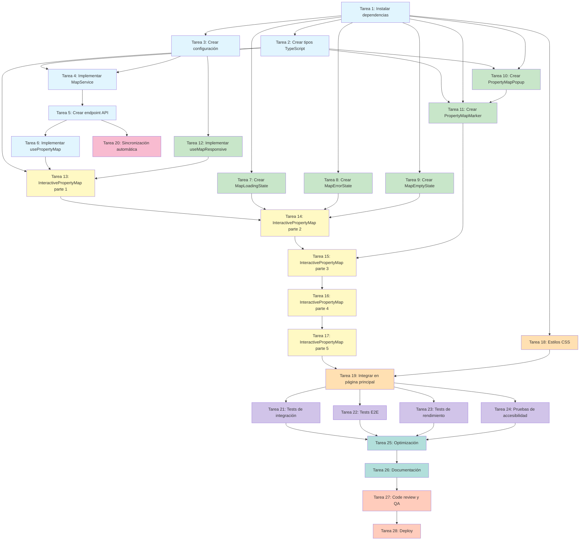

# Plan de Implementación - Mapa Interactivo de Propiedades

## Tareas de Implementación

- [x] 1. Instalar dependencias y configurar Leaflet
  - Instalar paquetes npm: `leaflet`, `react-leaflet`, `react-leaflet-cluster` y `@types/leaflet`
  - Agregar importación de estilos CSS de Leaflet en `app/globals.css`
  - Crear estilos personalizados para marcadores, clusters y popups
  - Verificar que las dependencias funcionen correctamente con Next.js 15
  - _Requisitos: 5.1, 5.4, NF-4.3_

- [x] 2. Crear tipos TypeScript para el mapa
  - Crear archivo `types/map.ts` con todas las interfaces definidas en el diseño
  - Definir `MapPropertyData`, `MapConfig`, `MapErrorType`, `MapError` class
  - Definir `MapInteractionEvent`, `InteractivePropertyMapProps`, `PropertyMapMarkerProps`
  - Definir `PropertyMapPopupProps`, `UsePropertyMapResult`, `UsePropertyMapOptions`
  - Definir `MapResponsiveConfig` y `MapBounds`
  - _Requisitos: NF-4.1, NF-4.3_

- [x] 3. Crear configuración del mapa
  - Crear archivo `lib/map-config.ts` con constante `MAP_CONFIG`
  - Definir centro inicial en Reconquista, Santa Fe (-29.1500, -59.6500)
  - Configurar límites geográficos de Argentina para validación
  - Definir configuración de OpenStreetMap tile layer con atribución
  - Configurar umbrales de clustering (50 propiedades)
  - Crear `MAP_RESPONSIVE_CONFIG` con breakpoints para móvil, tablet y desktop
  - Definir `MARKER_STYLES` para estados default y selected
  - _Requisitos: 1.3, 4.3, 5.3, NF-2.1, NF-2.2, NF-2.3_

- [x] 4. Implementar MapService
  - Crear archivo `services/map.ts` con clase `MapService`
  - Implementar método `getMapProperties()` que consulta Supabase
  - Aplicar filtros: `status = 'available'`, `latitude IS NOT NULL`, `longitude IS NOT NULL`
  - Seleccionar solo campos necesarios: id, title, price, currency, latitude, longitude, property_type, operation_type, images
  - Implementar método `validateCoordinates()` para validar límites de Argentina
  - Implementar método `calculateBounds()` para calcular límites geográficos del mapa
  - Implementar método `transformPropertyForMap()` para transformar datos de BD
  - Agregar manejo de errores con logs informativos
  - Escribir tests unitarios para `MapService` en `__tests__/services/map.test.ts`
  - _Requisitos: 2.1, 2.2, 3.1, 3.2, 4.1, 4.2, 4.3, 4.4, 7.4, 8.4_

- [x] 5. Crear endpoint API para ubicaciones del mapa
  - Crear archivo `app/api/properties/map-locations/route.ts`
  - Implementar función `GET` que llama a `MapService.getMapProperties()`
  - Retornar respuesta JSON con estructura: `{ success, properties, count, timestamp }`
  - Implementar manejo de errores con códigos HTTP apropiados (200, 500)
  - Agregar logs de errores para debugging
  - Considerar implementar rate limiting para prevenir abuso
  - _Requisitos: 1.1, 7.4, 8.2, 8.4, NF-3.4_

- [x] 6. Implementar hook usePropertyMap
  - Crear archivo `hooks/usePropertyMap.ts`
  - Implementar estado local: properties, loading, error, bounds
  - Implementar función `loadProperties` que hace fetch a `/api/properties/map-locations`
  - Agregar manejo de errores con tipos específicos (MapError)
  - Implementar timeout de carga (10 segundos) con AbortController
  - Calcular bounds automáticamente al cargar propiedades
  - Implementar auto-load al montar componente
  - Soportar refresh manual mediante función `refresh()`
  - Agregar soporte opcional para refresh interval
  - Retornar flag `isEmpty` para estado sin propiedades
  - Escribir tests para el hook en `__tests__/hooks/usePropertyMap.test.tsx`
  - _Requisitos: 1.1, 1.4, 7.1, 7.5, 8.1, 8.2, 8.3, 8.4, 8.5_

- [x] 7. Crear componente MapLoadingState
  - Crear archivo `components/map/MapLoadingState.tsx`
  - Implementar skeleton loader con altura configurable
  - Usar componentes de shadcn/ui (Skeleton) si están disponibles
  - Mostrar animación de carga atractiva y consistente con el diseño del sitio
  - _Requisitos: 1.5, 7.5_

- [x] 8. Crear componente MapErrorState
  - Crear archivo `components/map/MapErrorState.tsx`
  - Mostrar mensaje de error basado en el tipo de error
  - Incluir botón "Reintentar" que ejecute callback `onRetry`
  - Soportar altura configurable del contenedor
  - Usar estilos consistentes con el sistema de diseño del proyecto
  - _Requisitos: 1.5, 8.2, 8.3, 8.4, 8.5_

- [x] 9. Crear componente MapEmptyState
  - Crear archivo `components/map/MapEmptyState.tsx`
  - Mostrar mensaje: "No hay propiedades disponibles en este momento"
  - Permitir mensaje personalizado mediante prop
  - Soportar altura configurable del contenedor
  - Usar estilos consistentes con el sistema de diseño
  - _Requisitos: 8.1_

- [x] 10. Crear componente PropertyMapPopup
  - Crear archivo `components/map/PropertyMapPopup.tsx`
  - Mostrar información de propiedad: título, precio formateado, tipo de operación, tipo de propiedad
  - Incluir imagen thumbnail de la propiedad (primera imagen del array)
  - Usar componente Next.js Image optimizado con lazy loading
  - Agregar enlace "Ver Detalles" que navegue a `/propiedades/[id]`
  - Integrar con `useAnalytics` para rastrear evento `map_view_details`
  - Sanitizar datos con DOMPurify si es necesario
  - Aplicar estilos responsive (ancho mínimo/máximo según dispositivo)
  - _Requisitos: 2.3, 2.4, 2.5, 6.3, 9.2, NF-2.1, NF-2.2_

- [x] 11. Crear componente PropertyMapMarker
  - Crear archivo `components/map/PropertyMapMarker.tsx`
  - Usar componente `Marker` de react-leaflet
  - Configurar posición con `[property.latitude, property.longitude]`
  - Implementar icono personalizado usando `MARKER_STYLES` de configuración
  - Manejar evento click del marcador
  - Integrar con `useAnalytics` para rastrear evento `map_pin_click`
  - Renderizar `PropertyMapPopup` dentro de componente `Popup` de react-leaflet
  - Agregar atributos de accesibilidad: `tabIndex`, `aria-label`
  - Implementar soporte de teclado (Enter/Space para activar)
  - _Requisitos: 2.1, 2.3, 2.4, 6.3, 9.1, 9.4, NF-2.4_

- [x] 12. Implementar hook useMapResponsive
  - Crear hook personalizado en `components/InteractivePropertyMap.tsx` o separado
  - Detectar tamaño de ventana con `window.innerWidth`
  - Retornar configuración apropiada de `MAP_RESPONSIVE_CONFIG` (mobile, tablet, desktop)
  - Actualizar configuración cuando cambia el tamaño de ventana
  - Usar debounce para evento resize si es necesario
  - _Requisitos: NF-2.1, NF-2.2, NF-2.3, NF-2.4_

- [x] 13. Implementar componente InteractivePropertyMap (parte 1: estructura base)
  - Crear archivo `components/InteractivePropertyMap.tsx`
  - Marcar componente como `'use client'`
  - Importar dependencias de react-leaflet: `MapContainer`, `TileLayer`
  - Importar `MarkerClusterGroup` de react-leaflet-cluster
  - Definir props según interfaz `InteractivePropertyMapProps`
  - Integrar hook `usePropertyMap` para cargar propiedades
  - Integrar hook `useMapResponsive` para configuración responsive
  - Implementar lógica de estados: loading, error, empty
  - _Requisitos: 1.1, 1.2, 5.5, NF-4.1_

- [x] 14. Implementar componente InteractivePropertyMap (parte 2: renderizado del mapa)
  - Renderizar `MapLoadingState` cuando `loading === true`
  - Renderizar `MapErrorState` cuando `error !== null`
  - Renderizar `MapEmptyState` cuando `isEmpty === true`
  - Renderizar `MapContainer` con configuración de Leaflet
  - Configurar centro inicial y zoom basado en configuración responsive
  - Agregar `TileLayer` con URL de OpenStreetMap y atribución
  - Implementar lógica para usar `fitBounds` si hay bounds calculados
  - _Requisitos: 1.1, 1.3, 1.4, 1.5, 5.5_

- [x] 15. Implementar componente InteractivePropertyMap (parte 3: marcadores y clustering)
  - Implementar lógica condicional para clustering: activar si `properties.length > 50` o `enableClustering === true`
  - Configurar `MarkerClusterGroup` con opciones: `chunkedLoading`, `spiderfyOnMaxZoom`, `maxClusterRadius`
  - Crear función `iconCreateFunction` personalizada para clusters con estilos del proyecto
  - Renderizar `PropertyMapMarker` para cada propiedad en el array
  - Pasar callbacks apropiados a los marcadores
  - _Requisitos: 2.1, 2.6, 7.2, NF-5.1_

- [x] 16. Implementar componente InteractivePropertyMap (parte 4: integración con analytics)
  - Integrar hook `useAnalytics`
  - Rastrear evento `map_loaded` cuando las propiedades se cargan exitosamente
  - Incluir metadata: `properties_count`, `clustering_enabled`
  - Rastrear evento `map_error` cuando ocurren errores
  - Implementar debounce para eventos de zoom/pan si se rastrean
  - _Requisitos: 9.1, 9.2, 9.3, 9.4, 9.5, NF-3.2_

- [x] 17. Implementar componente InteractivePropertyMap (parte 5: accesibilidad)
  - Agregar atributos ARIA: `role="region"`, `aria-label`, `aria-describedby`
  - Crear elemento `
` oculto con `sr-only` para descripción del mapa
  - Incluir conteo de propiedades en descripción para screen readers
  - Asegurar que controles de zoom tengan focus visible
  - Verificar contraste de colores (mínimo 4.5:1)
  - _Requisitos: NF-1.1, NF-1.2_

- [x] 18. Agregar estilos CSS personalizados para el mapa
  - Agregar estilos al archivo `app/globals.css`
  - Importar `leaflet/dist/leaflet.css`
  - Crear estilos para `.custom-cluster-icon`
  - Personalizar `.leaflet-popup-content-wrapper` y `.leaflet-popup-content`
  - Estilizar controles de zoom `.leaflet-control-zoom`
  - Implementar estilos responsive con media queries para móvil
  - Asegurar que los colores cumplan con requisitos de contraste WCAG
  - _Requisitos: 5.3, NF-2.1, NF-2.4_

- [x] 19. Integrar mapa en la página principal
  - Abrir archivo `app/page.tsx`
  - Importar `InteractivePropertyMap` usando `dynamic` de Next.js
  - Configurar `ssr: false` y componente de loading
  - Agregar el componente en una sección visible y destacada de la página
  - Configurar altura apropiada del mapa
  - Verificar que el mapa se cargue correctamente sin errores de SSR
  - _Requisitos: 1.1, 1.2, 5.2, 5.5_

- [x] 20. Implementar sincronización automática de propiedades
  - Verificar que `MapService.getMapProperties()` filtre correctamente por status
  - Confirmar que cambios en status de propiedades se reflejan al recargar la página
  - Agregar logs informativos cuando se filtran propiedades por status
  - Documentar que la sincronización es automática pero requiere recarga de página
  - _Requisitos: 3.1, 3.2, 3.3, 3.4, 3.5, 3.6_

- [x] 21. Escribir tests de integración
  - Crear archivo `__tests__/components/InteractivePropertyMap.integration.test.tsx`
  - Test: debe renderizar mapa con marcadores
  - Test: debe abrir popup al hacer clic en marcador
  - Test: debe registrar evento de analytics al hacer clic
  - Test: debe navegar a página de detalles desde popup
  - Usar mocks para fetch API y hooks de analytics
  - _Requisitos: todos los requisitos funcionales_

- [x] 22. Escribir tests E2E
  - Crear archivo de tests E2E (Playwright o Cypress)
  - Test: debe cargar el mapa en la página principal
  - Test: debe mostrar popup al hacer clic en marcador
  - Test: debe navegar a detalles de propiedad desde popup
  - Test: debe funcionar en diferentes tamaños de pantalla (móvil, tablet, desktop)
  - _Requisitos: 1.1, 2.3, 6.1, 6.2, 6.3, NF-2.1, NF-2.2_

- [x] 23. Realizar tests de rendimiento
  - Verificar que el mapa carga en menos de 3 segundos con conexión 3G
  - Probar con 50+ propiedades para verificar clustering
  - Probar con 100+ propiedades para verificar degradación de performance
  - Usar Chrome DevTools Performance para identificar cuellos de botella
  - Optimizar si el tiempo de carga excede los límites establecidos
  - _Requisitos: 7.1, 7.2, 7.3, NF-5.1, NF-5.2_

- [x] 24. Realizar pruebas de accesibilidad
  - Verificar navegación con teclado (Tab, Enter, Space)
  - Probar con screen readers (NVDA, JAWS, VoiceOver)
  - Validar contraste de colores con herramientas WCAG
  - Verificar que todos los elementos interactivos tengan focus visible
  - Ejecutar Lighthouse Accessibility audit
  - Corregir cualquier problema de accesibilidad detectado
  - _Requisitos: NF-1.1, NF-1.2_

- [x] 25. Optimizar y pulir la implementación
  - Implementar memoización con `useMemo` para cálculos costosos
  - Agregar debouncing para eventos frecuentes si es necesario
  - Verificar que las imágenes en popups usen lazy loading
  - Revisar y optimizar consultas a Supabase
  - Asegurar que todos los errores se manejan gracefully
  - Revisar código para eliminar console.logs innecesarios
  - _Requisitos: 7.2, 7.3, NF-4.1, NF-5.3_

- [x] 26. Documentar la implementación
  - Actualizar README.md si es necesario con información del mapa
  - Documentar configuración de variables de entorno (si se agregaron)
  - Agregar comentarios JSDoc a funciones complejas
  - Documentar decisiones de diseño no obvias en el código
  - Crear guía de uso para administradores si es necesario
  - _Requisitos: NF-4.4, NF-4.5_

- [x] 27. Realizar code review y QA final
  - Revisar que todo el código sigue los patrones del proyecto
  - Verificar que se cumple CLAUDE.md (simplicidad, no sobre-ingeniería)
  - Probar todos los flujos de usuario manualmente
  - Verificar en diferentes navegadores (Chrome, Firefox, Safari, Edge)
  - Probar en diferentes dispositivos reales si es posible
  - Corregir cualquier bug o inconsistencia encontrada
  - _Requisitos: NF-1.1, NF-4.1_

- [x] 28. Deploy y monitoreo
  - Hacer commit de todos los cambios con mensaje descriptivo
  - Push a rama de desarrollo/feature
  - Crear pull request con descripción detallada
  - Deploy a ambiente de staging en Vercel
  - Realizar testing en staging
  - Obtener aprobación del equipo
  - Merge a rama principal y deploy a producción
  - Monitorear logs y analytics post-deploy
  - _Requisitos: todos los requisitos_
  - **Nota: Deploy será realizado manualmente por el equipo**

## Diagrama de Dependencias de Tareas

### Leyenda del Diagrama

- **Azul claro (T1-T6)**: Fundamentos y servicios base
- **Verde claro (T7-T12)**: Componentes auxiliares
- **Amarillo claro (T13-T17)**: Componente principal (InteractivePropertyMap)
- **Naranja claro (T18-T19)**: Estilos e integración
- **Rosa claro (T20)**: Sincronización
- **Púrpura claro (T21-T24)**: Testing
- **Verde azulado (T25-T26)**: Optimización y documentación
- **Naranja melocotón (T27-T28)**: Finalización y deploy

---

**🤖 Documento generado con [Claude Code](https://claude.com/claude-code)**
