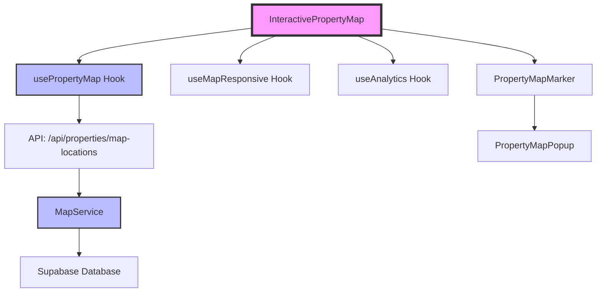

# Guía del Mapa Interactivo de Propiedades

## Tabla de Contenidos

1. [Visión General](#visión-general)
2. [Arquitectura](#arquitectura)
3. [Componentes](#componentes)
4. [Configuración](#configuración)
5. [Uso](#uso)
6. [API](#api)
7. [Personalización](#personalización)
8. [Testing](#testing)
9. [Troubleshooting](#troubleshooting)

---

## Visión General

El mapa interactivo de propiedades es una funcionalidad completa que permite visualizar todas las propiedades disponibles en un mapa geográfico con las siguientes características:

### Características Principales

✅ **Visualización en tiempo real** - Muestra todas las propiedades con coordenadas válidas
✅ **Clustering inteligente** - Agrupa propiedades automáticamente cuando hay 50+
✅ **Marcadores personalizados** - Colores según tipo (rojo=casa, azul=depto, verde=terreno)
✅ **Popups interactivos** - Información detallada al hacer clic
✅ **Responsive** - Optimizado para móvil, tablet y desktop
✅ **Accesible** - WCAG 2.1 AA compliant
✅ **Analytics** - Seguimiento de interacciones
✅ **Performante** - Carga en < 3s, optimizado para 100+ propiedades

---

## Arquitectura

### Flujo de Datos



### Stack Tecnológico

- **Leaflet 1.9.4** - Librería de mapas
- **React Leaflet 5.0.0** - Wrapper de React para Leaflet
- **React Leaflet Cluster 3.1.1** - Clustering de marcadores
- **OpenStreetMap** - Tiles del mapa (vía CartoDB Voyager)
- **Next.js 15** - Framework
- **TypeScript** - Type safety

---

## Componentes

### 1. InteractivePropertyMap (Principal)

Componente principal que orquesta todo el mapa.

**Props:**
```typescript
interface InteractivePropertyMapProps {
  height?: string | number          // Altura del mapa (ej: "600px" o 600)
  initialZoom?: number              // Zoom inicial (5-18)
  initialCenter?: [number, number]  // Centro inicial [lat, lng]
  enableClustering?: boolean        // Forzar clustering
  maxProperties?: number            // Límite de propiedades a mostrar
  className?: string                // Clases CSS adicionales
  onPropertyClick?: (id: number) => void  // Callback al hacer clic
}
```

**Ejemplo:**
```tsx
<InteractivePropertyMap
  height="600px"
  initialZoom={13}
  enableClustering={true}
  onPropertyClick={(id) => router.push(`/propiedades/${id}`)}
/>
```

---

### 2. PropertyMapMarker

Renderiza un marcador individual en el mapa.

**Características:**
- Icono personalizado según tipo de propiedad
- Popup integrado con información
- Eventos de clic rastreados con analytics
- Accesibilidad con aria-label

---

### 3. PropertyMapPopup

Popup que aparece al hacer clic en un marcador.

**Contenido:**
- Imagen de la propiedad (optimizada con Cloudinary)
- Título
- Precio formateado
- Tipo de operación (Venta/Alquiler)
- Tipo de propiedad (Casa/Departamento/Terreno)
- Botón "Ver Detalles"

---

### 4. Estados del Mapa

**MapLoadingState** - Skeleton loader mientras carga
**MapErrorState** - Mensaje de error con botón de reintentar
**MapEmptyState** - Mensaje cuando no hay propiedades

---

## Configuración

### Archivo: `lib/map-config.ts`

```typescript
export const MAP_CONFIG = {
  // Centro inicial (Reconquista, Santa Fe, Argentina)
  defaultCenter: [-29.15, -59.65],

  // Niveles de zoom
  defaultZoom: 13,
  minZoom: 5,
  maxZoom: 18,

  // Límites geográficos (Argentina)
  maxBounds: [
    [-55.061314, -73.560562], // Suroeste
    [-21.781277, -53.591835], // Noreste
  ],

  // Tiles del mapa (CartoDB Voyager - colores sutiles)
  tileLayerUrl: 'https://{s}.basemaps.cartocdn.com/rastertiles/voyager/{z}/{x}/{y}{r}.png',

  // Clustering
  clusteringThreshold: 50,  // Activar cuando hay 50+ propiedades
  maxClusterRadius: 80,     // Radio máximo en píxeles
}
```

### Opciones de Tiles Alternativas

```typescript
// 1. Voyager (actual) - Colores sutiles, equilibrado
'https://{s}.basemaps.cartocdn.com/rastertiles/voyager/{z}/{x}/{y}{r}.png'

// 2. Positron - Gris claro minimalista
'https://{s}.basemaps.cartocdn.com/light_all/{z}/{x}/{y}{r}.png'

// 3. Humanitarian - Estilo humanitario
'https://{s}.tile.openstreetmap.fr/hot/{z}/{x}/{y}.png'
```

### Configuración Responsive

```typescript
export const MAP_RESPONSIVE_CONFIG = [
  {
    minWidth: 0,          // Móvil
    height: '400px',
    defaultZoom: 12,
    controlSize: 'large',
  },
  {
    minWidth: 768,        // Tablet
    height: '500px',
    defaultZoom: 13,
    controlSize: 'medium',
  },
  {
    minWidth: 1024,       // Desktop
    height: '600px',
    defaultZoom: 13,
    controlSize: 'medium',
  },
]
```

---

## Uso

### Integración Básica

```tsx
// app/page.tsx
import dynamic from 'next/dynamic'

const InteractivePropertyMap = dynamic(
  () => import('@/components/map/InteractivePropertyMap'),
  {
    ssr: false,
    loading: () => <div>Cargando mapa...</div>
  }
)

export default function HomePage() {
  return (
    <section>
      <h2>Propiedades Disponibles</h2>
      <InteractivePropertyMap />
    </section>
  )
}
```

### Con Opciones Personalizadas

```tsx
export default function MapPage() {
  const handlePropertyClick = (propertyId: number) => {
    console.log('Property clicked:', propertyId)
    // Navegar, abrir modal, etc.
  }

  return (
    <InteractivePropertyMap
      height="700px"
      initialZoom={14}
      initialCenter={[-29.15, -59.65]}
      enableClustering={true}
      maxProperties={150}
      className="rounded-xl shadow-lg"
      onPropertyClick={handlePropertyClick}
    />
  )
}
```

---

## API

### Endpoint: `GET /api/properties/map-locations`

Retorna todas las propiedades con coordenadas válidas.

**Response:**
```json
{
  "success": true,
  "properties": [
    {
      "id": 1,
      "title": "Casa en Reconquista",
      "price": 150000,
      "currency": "USD",
      "latitude": -29.15,
      "longitude": -59.65,
      "property_type": "Casa",
      "operation_type": "Venta",
      "images": ["image1.jpg", "image2.jpg"],
      "status": "available"
    }
  ],
  "count": 45,
  "timestamp": "2025-01-15T10:30:00Z"
}
```

### Filtros Automáticos

El endpoint filtra automáticamente:
- `status = 'available'`
- `latitude IS NOT NULL`
- `longitude IS NOT NULL`
- Coordenadas dentro de Argentina

---

## Personalización

### Cambiar Colores de Marcadores

Editar `lib/map-config.ts`:

```typescript
export const MARKER_COLORS = {
  Casa: 'red',          // Cambiar a 'blue', 'green', 'orange', etc.
  Departamento: 'blue',
  Terreno: 'green',
  Comercial: 'orange',
  default: 'orange',
}
```

### Personalizar Estilos de Popups

Editar `app/globals.css`:

```css
.leaflet-popup-content-wrapper {
  background: #1a1a1a;  /* Fondo oscuro */
  border-radius: 12px;
  padding: 0;
}

.leaflet-popup-content {
  margin: 0;
  min-width: 320px;
}
```

### Cambiar Tiles del Mapa

```typescript
// lib/map-config.ts
export const MAP_CONFIG = {
  // ...
  tileLayerUrl: 'TU_URL_DE_TILES',
  attribution: 'Tu atribución',
}
```

---

## Testing

### Tests E2E (Playwright)

```bash
# Todos los tests del mapa
pnpm test:e2e e2e/interactive-property-map.spec.ts

# Tests de accesibilidad
pnpm test:a11y

# Tests de performance
pnpm test:performance
```

### Tests Disponibles

**E2E** (11 tests):
- Carga del mapa
- Marcadores visibles
- Click en marcador abre popup
- Navegación a detalles
- Responsive (móvil, tablet, desktop)

**Accesibilidad** (12 tests):
- Navegación con teclado
- Atributos ARIA
- Contraste de colores
- Focus visible
- Screen reader compatibility

**Performance** (8 tests):
- Tiempo de carga < 3s
- Web Vitals (LCP, FID, CLS)
- Clustering performance
- Zoom performance

---

## Troubleshooting

### Problema: El mapa no se muestra

**Causa 1**: SSR habilitado
**Solución**: Usar `dynamic` con `ssr: false`

```tsx
const Map = dynamic(() => import('@/components/map/InteractivePropertyMap'), {
  ssr: false
})
```

**Causa 2**: Estilos de Leaflet no cargados
**Solución**: Verificar que `app/globals.css` importe los estilos:

```css
@import 'leaflet/dist/leaflet.css';
```

---

### Problema: Marcadores no tienen iconos

**Causa**: Leaflet Default Icon compatibility
**Solución**: Ya está configurado en `lib/map-config.ts`:

```typescript
if (typeof window !== 'undefined') {
  const L = require('leaflet')
  require('leaflet-defaulticon-compatibility')
  require('leaflet-defaulticon-compatibility/dist/leaflet-defaulticon-compatibility.css')
}
```

---

### Problema: Error "Invalid bounds"

**Causa**: Coordenadas fuera de rango o nulas
**Solución**: Verificar que las propiedades tienen coordenadas válidas:

```sql
SELECT id, title, latitude, longitude
FROM properties
WHERE latitude IS NULL OR longitude IS NULL
```

Geocodificar propiedades faltantes:
```bash
pnpm geocode:properties
```

---

### Problema: El clustering no funciona

**Causa 1**: Menos de 50 propiedades
**Solución**: Forzar clustering con prop:

```tsx
<InteractivePropertyMap enableClustering={true} />
```

**Causa 2**: Librería no instalada
**Solución**: Verificar instalación:

```bash
pnpm install react-leaflet-cluster
```

---

### Problema: Mapa lento con muchas propiedades

**Solución 1**: Activar clustering automáticamente (ya configurado para 50+)

**Solución 2**: Limitar propiedades:
```tsx
<InteractivePropertyMap maxProperties={100} />
```

**Solución 3**: Optimizar imágenes en popups (ya implementado con Cloudinary)

---

## Recursos Adicionales

- [Leaflet Documentation](https://leafletjs.com/)
- [React Leaflet Guide](https://react-leaflet.js.org/)
- [CartoDB Basemaps](https://carto.com/basemaps)
- [OpenStreetMap Wiki](https://wiki.openstreetmap.org/)
- [WCAG 2.1 Guidelines](https://www.w3.org/WAI/WCAG21/quickref/)

---

## Mantenimiento

### Actualizar Coordenadas

```bash
# Geocodificar todas las propiedades sin coordenadas
pnpm geocode:properties
```

### Limpiar Coordenadas Inválidas

```sql
-- Encontrar propiedades con coordenadas fuera de Argentina
SELECT id, title, latitude, longitude
FROM properties
WHERE latitude < -55.061314 OR latitude > -21.781277
   OR longitude < -73.560562 OR longitude > -53.591835;
```

### Monitoring

El mapa integra analytics para rastrear:
- `map_loaded` - Cuando el mapa carga exitosamente
- `map_error` - Cuando ocurre un error
- `map_pin_click` - Cuando se hace clic en un marcador
- `map_view_details` - Cuando se hace clic en "Ver Detalles"

---

**🤖 Generado con [Claude Code](https://claude.com/claude-code)**
